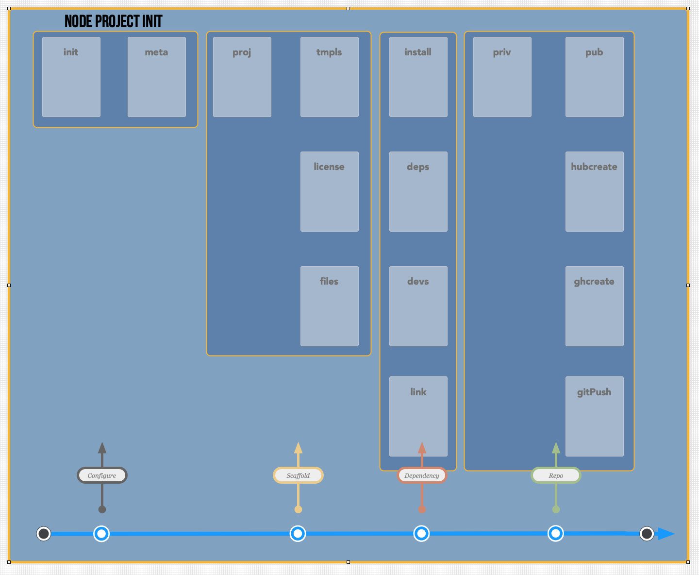
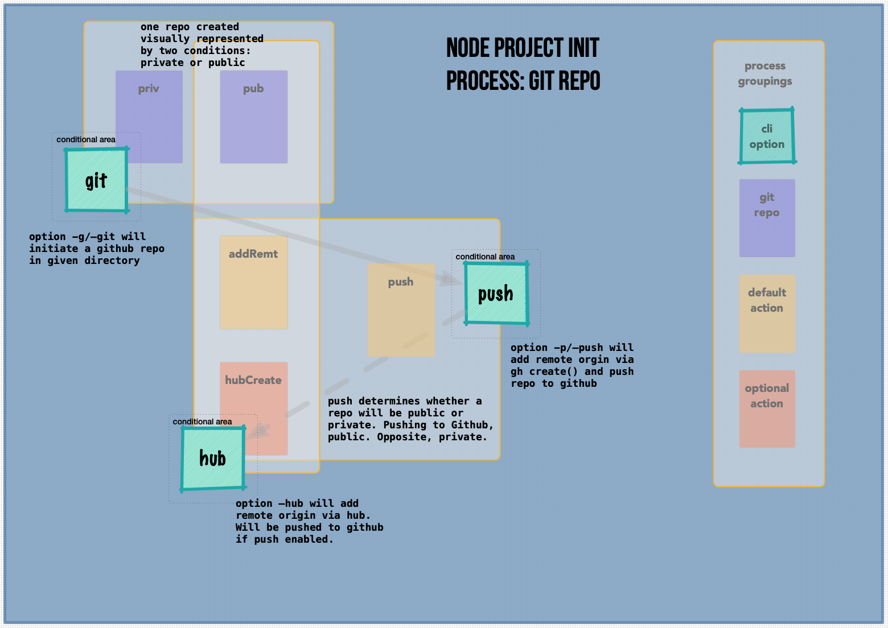

# test-npinit
[![alpha][stability-image]][stability-url]

Documenting the process of re-working [npinit](https://github.com/akileez/npinit) and re-learning git.

### Program Structure

How I view the project at the moment. Four distinct processing areas, six functional groupings and eight operational processes.

### CLI Options

My thoughts on simplifying the command line options.
* **git:** initiates a git repo
* **push:** adds remote option [default: `gh create()`] and pushes repo to github
* **hub:** if `hub` is installed, this option will add remote via `hub`

[stability-image]: https://img.shields.io/badge/stability-alpha-darkorange.svg?style=flat-square
[stability-url]: https://github.com/akileez/test-npinit